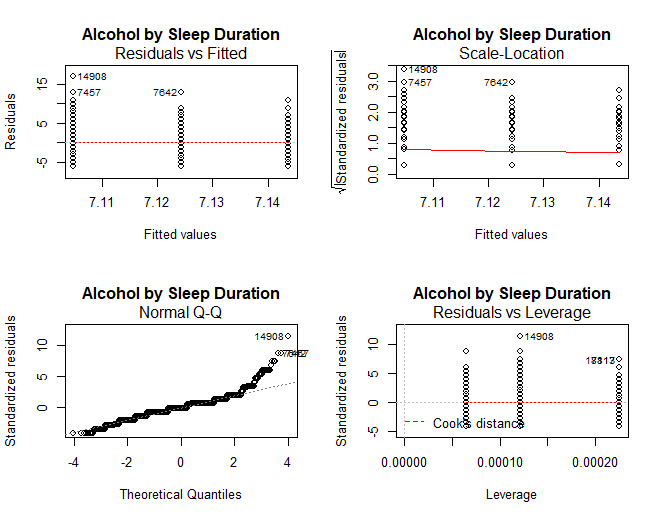
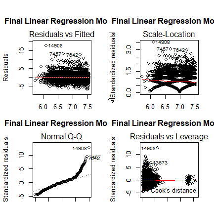

# BRFSS Health Descriptive Analysis
In this repository, we explore the use of BRFSS dataset for descriptive and regression analysis. The study demonstrated in this repository mainly focuses on the effect of different risk factors to veterans sleep quality. There are three parts of this project,  
1) demonstrate data collection and cleaning process  
2) create a summary table for descriptive analysis  
3) applies forward selection process for linear regression and logistic regression models  

## Part I - Data Cleaning
The data set we are going to use for demonstration can be downloaded from the CDC BRFSS website. We focus our analysis on 2014 data set, but you can easily find the data set from different time period or combind them in your analysis.  The xpt (SAS) data file and documentation for the data set can be found [here](https://www.cdc.gov/brfss/smart/smart_2014.html).  Note that we do not upload the original xpt data file in this repository because the file size is over the repository limit. We only include the cleaned data set in CSV format for the analysis.

#### Cleaning Process:
Step 1: Remove columns (variables) that is not relevant to the study.  
Step 2: Remove rows we don't need. Since our focus in this anaysis is mainly focus on sleeping problem for veterans, so we are going to remove observation that is not veteran.  
Step 3: Remove rows with invalid values based on documentation (e.g. ALCDAY5=999 or NA)  
Step 4: Create new columns based on the orginal variable values (e.g. (ALCDAYS<200) => 3)  
Step 5: Create dummy variables for categorical variable in the data set (for regression analysis)  
Step 6: Remove rows with missing value  

After cleaning the data set, we exported the cleaned data set and saved it as CSV file.

## Part II - Descriptive Analysis

#### Statistical Summary Table:
Three main type of descriptive statistics are frequencies, measures of central tendency, and measures of variability. We use R calculate the frequency distribution for the categorical outcome variable (ASTHMA4) and mean and variance for the continuous outcome variable (SLEPTIM2). The summary tables is helpful in understanding the overall structure of the outcome variables. The summary tables are recorded in two separated excel files and can be found in the data folder.

#### Bivariate Analysis:
Bivariate analysis is one of the simplest forms of quantitative analysis, which is designed to test for the empirical relationship between two variables. Below is a list of bivariate tests for different type of data combination.

|  Independent Variable  |  Dependent Variable  |  Test  |
|  :---:  |  :---:  |  :---:  |
|  Categorical (ALCGRP)  |  Categorical (ASTHMA4)  |  Chi-squared or Fisher's exact test  |
|  Categorical (ALCGRP)  |  Continuous (SLEPTIM2)  |  Analysis of Variance (ANOVA)  |
|  Categorical with only 2 categories (SEX)  |  Continuous (SLEPTIM2)  |  Independent Group t-test  |
|  Continuous (Weight in pounds)  |  Continuous (SLEPTIM2)  |  Correlation  |

## Part III - Regression Analysis
The main object for performing a regression analysis on the data set is to explore the relationship between outcome variable and the explanatory variables in the study. In this repository, we demonstrate the use of **Linear Regression Model** and **Logistic Regression Model**. Generally speaking, linear regression is applied when the outcome variable is continuous and logistic regression is used when the outcome variable is a binary choice, such as Yes/No, Up/Down, True/False, etc.

#### Prepare for Linear Regression Analysis:
Before jumping into the regression model, we should examine the assumptions in linear regression model.  One common way to do it is use the visualize tools in the statistical package.  We can check the linear relationship between outcome variable and key variable of interest by plotting the **normal probability plot** and **residuals vs. predicted values**.

#### Feature Engineering:
Sometime,the data we have may not be sufficient to fit the model for various reasons. It's important to check and see if any modification or transformation is needed before fitting the data to the model. We deomonstrate the use of a few common transformation techniques in the example.
- Categorization and Transformation
- Indexes for Categorical Variable
- Quartiles Transformation
- Ranking the Continuous Variable

#### Choices of Modeling Approaches:
- Linear Regression: When dependent variable (outcome variable) is continuous
- Logistic Regression When dependent variable (outcome variable) is a binary choice.

#### Choosing the Correct Functional Form:
There are three main approaches to figure out the functional form of a regression model. We demonstrate the **forward stepwise regression** (or **forward selection**) in this example.

|  Atttribute  |  Forward Stepwise  |  Backward Stepwise |  Ambidirectional  |
|  :---:  |  :---:  |  :---:  |  :---:  |
|  Process  |  Run iterative models introducing a new variable each round  |  Start with all the variables in a model, an then run iterative models and remove variables each round  |  A custom combination of the two  |
|  Popularity  |  Not Popular  |  Extrememly Popular  |  A dirty Secret  |
|  Issues  |  At the end, try to put variable back inthat got kicked out  |  Start with all the variable all and the software can break due to small sells; also, no feel for data  |  Hard to explain in the methods section  |

For both the linear regression and logistic regression model, we apply the same model selection process. 

|  Model 1: Base Model  |  Model 2: Adjusted for Age and Sex  |  Model 3: Fully Adjusted  |
|  :---:  |  :---:  |  :---:  |
|  Only includes exposure indicator variables. May be more than one with multilevel exposure.  |  Includes all covariates in Model 1, plus age and sex covariates.  |  Includes all covariates that survive the forward stepwise modeling process.  |

#### Linear Regression:

#### Logistic Regression:

Copyright © 2020 Norman Lo
